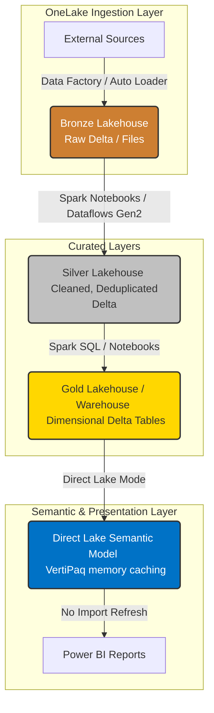

# microsoft-fabric-architects-playbook

> Enterprise Microsoft Fabric architecture and DevOps playbook with deep best practices, real patterns, and production examples.

---

## 🏗️ Enterprise Medallion & Serving Architecture Flow

The Microsoft Fabric platform unifies compute, storage, and governance over a single, open logical lakehouse structure. Data moves seamlessly from high-scale ingestion to highly performant, Direct Lake-enabled semantic layers.



---

## Table of Contents

1. [Repository Goals](#repository-goals)
2. [Recommended Repository Name](#recommended-repository-name)
3. [Architecture Principles](#architecture-principles)
4. [Platform Foundations](#platform-foundations)
5. [Data Engineering and Ingestion](#data-engineering-and-ingestion)
6. [Lakehouse, Warehouse, and Semantic Layer Design](#lakehouse-warehouse-and-semantic-layer-design)
7. [Real-Time Intelligence](#real-time-intelligence)
8. [Security and Governance](#security-and-governance)
9. [Performance and Cost Optimization](#performance-and-cost-optimization)
10. [DevOps, Git Integration, and Deployment Pipelines](#devops-git-integration-and-deployment-pipelines)
11. [Advanced Techniques](#advanced-techniques)
12. [Definition of Done Checklist](#definition-of-done-checklist)
13. [Suggested Naming Standards](#suggested-naming-standards)
14. [Example Measurable Outcomes to Track](#example-measurable-outcomes-to-track)
15. [References](#references)
16. [License and Usage](#-license-and-usage)

---

## Repository Goals

This repository documents practical, field-tested guidance for building maintainable, governed, and high-performance Microsoft Fabric solutions across:

- OneLake architecture & logical layout strategy.
- Medallion data design (Bronze / Silver / Gold) with built-in quality gates.
- Lakehouse and Warehouse implementation with optimal partition practices.
- Data Factory pipelines and Dataflows Gen2 for scalable low-code ingestion.
- Spark notebooks and SQL-based transformations.
- Direct Lake semantic models and Power BI memory-aligned consumption.
- Real-Time Intelligence with Eventstreams, Eventhouse, and KQL telemetry.
- Security, permissions, and Microsoft Purview information protection.
- Git integration, deployment pipelines, and ALM automation.

---

## Recommended Repository Name

The recommended GitHub repository name for this documentation is:

```text
microsoft-fabric-architects-playbook
```

### Why this name works well

- It clearly identifies the repository as a Microsoft Fabric architecture guide.
- It matches enterprise GitHub naming conventions.
- It aligns nicely with a companion repository such as `powerbi-architects-playbook`.

---

## Architecture Principles

| Principle | Description | Why it matters |
|---|---|---|
| One copy of data | Reuse OneLake instead of duplicating data across tools | Reduces storage sprawl and governance overhead |
| Layer by quality | Organize data as Bronze, Silver, Gold | Improves trust, lineage, and maintainability |
| Separate platform from consumption | Build reusable data products before reports | Reduces report-specific rework |
| Optimize for both performance and operability | Design for query speed and maintainable refresh/processing | Better user experience and lower support cost |
| Govern by design | Apply permissions, naming, ownership, and lifecycle controls early | Reduces security and compliance risk |
| Treat metadata as code | Version Fabric assets where supported | Safer collaboration and repeatable delivery |

---

## Platform Foundations

### 1) OneLake Strategy

#### Why this matters

**Business rationale**
- OneLake reduces fragmentation by providing a single logical data lake for the organization.
- Shared storage and reuse reduce duplicated engineering effort and lower total cost of ownership.

**Technical rationale**
- Fabric stores analytics items in OneLake and supports shared access patterns across lakehouse, warehouse, notebooks, and semantic models.
- Open formats and shared storage simplify interoperability.

#### How to do it step by step

1. Define data domains or product areas.
2. Create workspaces aligned to ownership and environment strategy.
3. Store raw, refined, and curated data in OneLake-oriented structures.
4. Avoid creating duplicate copies unless there is a justified isolation, residency, or performance need.
5. Define naming standards for workspaces, lakehouses, warehouses, shortcuts, and semantic models.

**Example naming convention**

```text
<domain>-<layer>-<environment>
finance-bronze-dev
finance-silver-test
finance-gold-prod
```

#### Effect / gain

- Better data discoverability.
- Lower duplication of files and transformations.
- Easier governance and access management.

#### What to avoid

- Creating separate storage silos for every team without a domain strategy.
- Replicating the same datasets across many workspaces “just in case”.
- Mixing raw ingestion and curated consumption assets without boundaries.

---

### 2) Medallion Architecture

#### Why this matters

**Business rationale**
- Bronze, Silver, and Gold separation makes ownership, data contracts, and audit trails clearer.
- It helps teams trace KPI issues back to specific transformation layers.

**Technical rationale**
- Fabric recommends medallion architecture in OneLake-based implementations.
- Layering improves testability, reusability, and downstream semantic model stability.

---

### Bronze Layer

#### Concept & Pattern Code

Rules:
*   Append-only.
*   Raw schema preserved without business modifications.
*   Add ingestion metadata (timestamp, source file name).

```python
from pyspark.sql import functions as F

# Configure Auto Loader for robust, low-latency files ingestion into Bronze
bronze_stream = (
    spark.readStream
    .format("cloudFiles")
    .option("cloudFiles.format", "json")
    .option("cloudFiles.schemaLocation", "Files/schemas/bronze_sales")
    .load("Files/raw/sales")
)

# Append tech metadata for lineage audits
bronze_with_metadata = (
    bronze_stream
    .withColumn("ingested_at", F.current_timestamp())
    .withColumn("source_filename", F.input_file_name())
)

# Write as stream directly to a Delta Table in the Lakehouse
(
    bronze_with_metadata.writeStream
    .format("delta")
    .option("checkpointLocation", "Files/checkpoints/bronze_sales")
    .outputMode("append")
    .toTable("bronze_sales")
)
```

#### How to Apply
1.  **Always use Auto Loader (`cloudFiles`)** over static directory loads for unstructured or semi-structured raw storage files.
2.  Define a stable, isolated checkpoint path on OneLake to maintain transactional processing consistency even if the pipeline halts.
3.  Avoid applying any filters, business formatting, or lookups in this layer.

#### How to Verify
1.  **Check Stream Actions:** Run `DESCRIBE HISTORY bronze_sales`. Verify the operations are logged as `STREAMING UPDATE` transactions.
2.  **Verify Lineage Metadata:** Ensure columns `ingested_at` and `source_filename` exist and are populated by querying:
    ```sql
    SELECT ingested_at, source_filename FROM bronze_sales LIMIT 5;
    ```

---

### Silver Layer

#### Concept & Pattern Code

Rules:
*   Schema enforcement, data cleansing, and mapping columns to corporate standard names.
*   Strict deduplication on business keys (e.g., `order_id`).
*   Idempotency maintained through incremental `MERGE` statements.

```python
from pyspark.sql import functions as F

# Stream read from Bronze, drop duplicates, and apply strong types
silver_stream = (
    spark.readStream
    .table("bronze_sales")
    .filter(F.col("order_id").isNotNull())
    .dropDuplicates(["order_id"])
    .select(
        F.col("order_id").cast("string"),
        F.col("customer_id").cast("string"),
        F.col("amount").cast("decimal(18,2)").alias("amount"),
        F.col("order_date").cast("date")
    )
)

# MERGE logic executed inside foreachBatch to prevent late-arriving duplicates
def merge_records(micro_df, batch_id):
    micro_df.createOrReplaceTempView("updates")
    micro_df._jdf.sparkSession().sql("""
        MERGE INTO silver_sales t
        USING updates s
        ON t.order_id = s.order_id
        WHEN MATCHED THEN
          UPDATE SET *
        WHEN NOT MATCHED THEN
          INSERT *
    """)

(
    silver_stream.writeStream
    .format("delta")
    .option("checkpointLocation", "Files/checkpoints/silver_sales")
    .foreachBatch(merge_records)
    .start()
)
```

#### How to Apply
1.  Do not use static overwriting (`overwrite` mode) for running Silver pipelines; use incremental streams combined with a `MERGE` block inside `foreachBatch`.
2.  Handle any missing fields or corrupt files by filtering them out or writing them to a dedicated quarantine workspace directory.

#### How to Verify
1.  **Verify Uniqueness:** Run a query to confirm no duplicate business keys exist:
    ```sql
    SELECT order_id, COUNT(*) FROM silver_sales GROUP BY order_id HAVING COUNT(*) > 1;
    ```
    *This must return zero records.*
2.  **Verify Transactions:** Check table history using `DESCRIBE HISTORY silver_sales` and verify the output consists of `MERGE` actions.

---

### Gold Layer & V-Order Optimization (The Ultimate Serving Hack)

#### Concept & Pattern Code

Rules:
*   Aggregated metrics and star-schema modeled dimensions.
*   **V-Order Write Optimization enabled:** V-Order is a Microsoft-proprietary write optimization that rearranges data in OneLake Delta files similarly to the VertiPaq engine, boosting Direct Lake Power BI performance exponentially [1.1].

```python
# Enable V-Order globally inside the Spark Session configuration
spark.conf.set("spark.sql.parquet.vorder.enabled", "true")

# Aggregate clean Silver data into a Gold serving table
gold_agg = (
    spark.read.table("silver_sales")
    .groupBy("order_date")
    .agg(F.sum("amount").alias("daily_revenue"))
)

# Write to Gold table with V-Order optimization active
(
    gold_agg.write
    .mode("overwrite")
    .format("delta")
    .option("write.parquet.vorder.enabled", "true")
    .saveAsTable("gold_sales_daily")
)
```

#### How to Apply
1.  **Always enable V-Order** on your Gold layer tables [1.1]. It is the critical prerequisite for high-performance Direct Lake semantic models, preventing CPU-heavy cache refreshes.
2.  Pre-aggregate heavy granular tables in Gold so the semantic layer doesn't have to perform high-cardinality calculations.

#### How to Verify
1.  **Verify V-Order Compression:** Run a DESCRIBE query using SQL:
    ```sql
    DESCRIBE DETAIL gold_sales_daily;
    ```
    *Confirm that the table size and file metadata indicate Microsoft V-Order format optimization is active [1.1].*

---

### Advanced Medallion Practices

- Separate schemas per layer (bronze, silver, gold) to isolate compute contexts and maintain security boundaries.
- Use Delta format only (no raw parquet or CSV formats for serving).
- Rebuild downstream with idempotent backfills when logic changes.
- Document lineage from source to reporting endpoints.

---

### 3) Workspace and Environment Design

#### Why this matters

**Business rationale**
- Clear environment isolation boundaries reduce human error and minimize support tickets.

**Technical rationale**
- Fabric organizes collaboration, item permissions, and lifecycle management around workspaces.

#### How to do it step by step

1. Decide whether workspaces are organized by domain, environment, or product.
2. Separate **Dev / Test / Prod** workspaces explicitly.
3. Assign workspace roles by least privilege (utilize synced security groups, not individual user accounts).
4. Use deployment pipelines or ALM automation to move content between environments.
5. Define ownership and support contacts per workspace.

#### Effect / gain

- Cleaner promotions and rollback paths.
- Lower risk of accidental production edits.
- Stronger auditability of changes.

#### What to avoid

- Keeping a single giant workspace for every asset in the company.
- Allowing developers to work directly in production workspaces.
- Leaving critical business data products with no designated owners.

---

## Data Engineering and Ingestion

### 1) Pipelines and Dataflows Gen2

#### Why this matters

**Business rationale**
- Reliable ingestion is the foundation for trustworthy analytics.

**Technical rationale**
- Fabric Data Factory capabilities orchestrate movement and transformation across sources and Fabric items.

#### How to do it step by step

1. Use **Pipelines** to orchestrate ingestion, notebook execution, SQL scripts, and dependencies.
2. Use **Dataflows Gen2** for reusable low-code transformations when they fit the scenario.
3. Parameterize source locations and environment-specific settings.
4. Add retries, alerts, and dependency control.
5. Land data in Bronze with consistent naming and metadata.

**Example pseudo pipeline sequence**

```text
1. Copy ERP sales data to bronze layer
2. Execute notebook for cleansing and conformance
3. Run SQL script for gold tables
4. Refresh semantic model or trigger downstream task
5. Log status and notify on failure
```

#### Effect / gain

- More repeatable ingestion operations.
- Better orchestration visibility.
- Lower manual intervention in refresh windows.

#### What to avoid

- Hard-coded parameters across environments.
- Monolithic pipelines with no modularity.
- Silent failures without alerting or logging.

---

### 2) Notebooks and Spark Transformations (Starter Pools Optimization)

#### Why this matters

**Business rationale**
- Notebooks enable scalable engineering patterns for cleansing, enrichment, and large transformations.

**Technical rationale**
- Spark is appropriate when SQL-only transformations become too complex, too large, or too iterative.
- By default, launching a Spark notebook can take 1 to 2 minutes of cold-start time while nodes are being provisioned. You can reduce this to under 5 seconds by configuring **Starter Pools** in your Workspace settings.

#### How to do it step by step

1. Use notebooks for transformations requiring Spark-scale processing.
2. Standardize notebook structure (parameters, imports, read, validate, transform, write, log).
3. Write outputs as Delta tables.
4. Keep notebook logic deterministic and idempotent.
5. Navigate to your **Fabric Workspace Settings ➡️ Synapse Data Engineering ➡️ Spark Settings** and enable **Starter Pools** instead of Custom Pools to pre-allocate warm idle nodes.

**Example parameterized notebook snippet**

```python
layer = "silver"
source_table = "bronze_sales"
target_table = f"{layer}_sales"

source_df = spark.read.table(source_table)

result_df = source_df.filter("OrderStatus <> 'Cancelled'")
result_df.write.mode("overwrite").format("delta").saveAsTable(target_table)
```

#### Effect / gain

- Better scalability for heavy transformations.
- Spark session initialization completes within **3 to 5 seconds** instead of minutes.
- Reusable engineering patterns across projects.

#### What to avoid

- Manual notebook edits in production with no version control.
- Business-critical logic embedded in ad hoc analyst notebooks.
- Running heavy data engineering jobs on long-running, non-autoscaling custom clusters.

---

### 3) Shortcuts and Data Reuse

#### Why this matters

**Business rationale**
- Reusing data without physically copying it can reduce both storage cost and duplication.

**Technical rationale**
- Shortcuts help create logical access patterns to data already present in OneLake or external storage systems.

#### How to do it step by step

1. Identify datasets that should be reused rather than copied.
2. Create shortcuts into approved source data locations.
3. Validate permissions, lineage, and refresh expectations.
4. Document the dependency so downstream teams understand ownership.

#### Effect / gain

- Lower storage duplication.
- Faster onboarding of consuming teams.
- Better alignment with data product thinking.

#### What to avoid

- Using shortcuts without ownership agreements.
- Shortcut chains that become difficult to understand or troubleshoot.
- Mixing reusable source data with team-local scratch assets.

---

### 4) Delta Live Tables (DLT) Data Quality Pattern

#### Why this matters

**Business rationale**
- Trusted analytics require explicit quality gates.

**Technical rationale**
- In Fabric, you can write declarative **Expectations** to enforce data quality and automatically track, quarantine, or fail pipelines based on custom validation rules [2.1].

```python
import dlt
from pyspark.sql import functions as F

@dlt.table(
    name="sales_silver",
    comment="Cleaned sales records with DLT expectations"
)
# Quarantine rule (invalid records are dropped)
@dlt.expect_or_drop("valid_order_id", "order_id IS NOT NULL")
# Warning rule (invalid records logged but kept)
@dlt.expect("positive_amount", "amount > 0")
def sales_silver():
    return (
        dlt.read_stream("sales_bronze")
        .select(
            col("order_id"),
            col("amount").cast("decimal(18,2)")
        )
    )
```

#### How to Apply
1.  Apply `@expect` (warnings), `@expect_or_drop` (filters), and `@expect_or_fail` (breaks stream) to manage data cleanliness [2.1].
2.  If running standard pipelines outside DLT, write a split query: direct valid rows to the Silver table, and invalid rows to `quality_quarantine_sales`.

#### How to Verify
1.  **Check DLT Quality UI:** Open the pipeline execution dashboard in Microsoft Fabric. Review the "Data Quality" panel to inspect the total volume of passed, warned, and dropped rows.

#### What to avoid

- Replacing all faulty values with defaults such as zero.
- Publishing unvalidated Silver tables as Gold.
- Hiding data quality failures instead of surfacing them.

---

## Lakehouse, Warehouse, and Semantic Layer Design

### 1) Lakehouse vs Warehouse Decision

#### Why this matters

**Business rationale**
- Different consumers and workloads need different serving patterns.

**Technical rationale**
- Fabric supports both lakehouse and warehouse architectures, and they can coexist over shared storage foundations.

#### How to do it step by step

1. Use **Lakehouse** when Spark, notebooks, open-format engineering, or data science are primary requirements.
2. Use **Warehouse** when SQL-centric analytics, relational serving, and warehouse-style development are primary requirements.
3. Combine them when engineering and SQL consumption both matter.
4. Publish only stable, trusted Gold assets to downstream semantic models.

#### Effect / gain

- Better fit between user personas and serving layer.
- Lower friction between data engineering and analytics teams.

#### What to avoid

- Treating every dataset as a warehouse by default.
- Treating every analytics requirement as a notebook problem.
- Building semantic models directly on unstable Silver assets.

---

### 2) Direct Lake Semantic Models & Guardrails

#### Why this matters

**Business rationale**
- Direct Lake can deliver fast interactive analytics over large Fabric-managed data without full import refresh overhead.

**Technical rationale**
- Direct Lake uses VertiPaq for query speed while sourcing from Delta tables in OneLake.
- However, if a table's schema changes, or if the Fabric Capacity memory limit is exceeded, the model will silently fall back to slow **DirectQuery** mode. You must explicitly configure guardrails to prevent this.

#### How to do it step by step

1. Design Gold tables with analytic consumption and V-Order optimization in mind [1.1].
2. Create a semantic model from a Fabric item or in Power BI Desktop.
3. Open your semantic model in **Tabular Editor** via the XMLA Endpoint.
4. Navigate to the Model properties and change **`DirectLakeBehavior`** from `Automatic` to **`DirectLakeOnly`**.
5. Use explicit measures instead of relying only on implicit aggregations.

**Example DAX measures**

```DAX
[Sales Amount] = SUM ( 'Fact Sales'[SalesAmount] )

[Gross Margin] =
SUM ( 'Fact Sales'[SalesAmount] ) - SUM ( 'Fact Sales'[CostAmount] )

[Gross Margin %] =
DIVIDE ( [Gross Margin], [Sales Amount] )
```

#### Effect / gain

- No silent fallback to slow DirectQuery; developers catch memory or V-Order issues instantly.
- Faster time-to-consumption for large Gold assets.
- Better alignment between Fabric engineering and Power BI consumption.

#### What to avoid

- Publishing Direct Lake models on poorly curated Gold tables.
- Leaving `DirectLakeBehavior` set to `Automatic` on production-scale models, hiding silent query slowdowns.
- Ignoring storage mode and security implications.

---

### 3) Dimensional Modeling for Fabric Semantic Layers

#### Why this matters

**Business rationale**
- BI consumers still need stable facts, dimensions, and clear KPIs—even in a lake-first platform.

**Technical rationale**
- Star schema remains the preferred semantic modeling pattern for accurate and performant analytic models.

#### How to do it step by step

1. Build Gold fact and dimension tables.
2. Keep facts narrow and numeric-heavy.
3. Use a proper date dimension.
4. Resolve many-to-many with bridge structures where appropriate.
5. Create explicit measures.
6. Hide technical columns.

**Example Date dimension in SQL**

```sql
CREATE OR REPLACE TABLE dim_date AS
SELECT
    d AS CalendarDate,
    YEAR(d) AS CalendarYear,
    MONTH(d) AS MonthNumber,
    DATE_FORMAT(d, 'MMMM') AS MonthName,
    CONCAT(YEAR(d), '-', LPAD(MONTH(d), 2, '0')) AS YearMonth
FROM (
    SELECT explode(sequence(to_date('2024-01-01'), to_date('2030-12-31'), interval 1 day)) AS d
) x;
```

#### Effect / gain

- Simpler report development.
- More reliable DAX.
- Lower risk of ambiguous or incorrect totals.

#### What to avoid

- Exposing raw normalized operational schemas directly to analysts.
- Using many-to-many relationships as a shortcut for poor design.
- Embedding all KPI logic in report visuals.

---

### 4) SQL Endpoint and SQL Development Practices (Native RLS)

#### Why this matters

**Business rationale**
- SQL remains the common language for analytics teams and operational support.

**Technical rationale**
- SQL endpoints and warehouse SQL patterns make transformations and validations easier to standardize and review.
- Microsoft Fabric SQL Endpoints support native SQL Server-style Row-Level Security, securing the tables directly in the serving layer.

#### How to do it step by step

1. Standardize SQL style rules.
2. Create a dedicated Security Schema:
   ```sql
   CREATE SCHEMA Security;
   ```
3. Define a security predicate function using `SCHEMABINDING`:
   ```sql
   CREATE FUNCTION Security.fn_securitypredicate(@Region AS sysname)
       RETURNS TABLE
   WITH SCHEMABINDING
   AS
       RETURN SELECT 1 AS fn_securitypredicate_result
       WHERE @Region = USER_NAME() OR USER_NAME() = 'AdminGroup';
   ```
4. Bind the predicate function as a `FILTER PREDICATE` on the target table using a security policy:
   ```sql
   CREATE SECURITY POLICY Security.SalesFilter
   ADD FILTER PREDICATE Security.fn_securitypredicate(Region)
   ON gold_sales_daily;
   ```

#### Effect / gain

- Security is enforced directly in the serving layer across all consuming clients.
- Easier peer review of transformations.
- Better maintainability of Gold-layer logic.

#### What to avoid

- Hidden transformation logic spread across many undocumented notebooks and scripts.
- Building custom SQL views to mimic security, which adds to schema fragmentation and overhead.

---

## Real-Time Intelligence

### 1) Eventstreams, Eventhouse, and KQL

#### Why this matters

**Business rationale**
- Some use cases require telemetry, operational monitoring, or near-real-time decision support.

**Technical rationale**
- Fabric supports real-time ingestion and analysis scenarios through Eventstreams, Eventhouse, and KQL.

#### How to do it step by step

1. Define the event source and desired latency.
2. Ingest events through supported real-time patterns.
3. Store and analyze data in Eventhouse/KQL structures where appropriate.
4. Model downstream aggregates for operational dashboards.
5. Separate exploratory telemetry from governed business KPIs.

**Example KQL**

```kusto
SalesEvents
| where EventTime > ago(1h)
| summarize TotalSales = sum(SalesAmount), Orders = dcount(OrderId) by bin(EventTime, 5m), Region
| order by EventTime asc
```

#### Effect / gain

- Faster operational visibility.
- Better alerting and anomaly analysis patterns.
- More suitable architecture for streaming or high-frequency event use cases.

#### What to avoid

- Forcing all data into real-time architecture when batch analytics is enough.
- Mixing lightly governed event data with certified business measures.
- Skipping retention and cost planning for event workloads.

---

## Security and Governance

### 1) Permission Model

#### Why this matters

**Business rationale**
- Access should follow business roles and least privilege.

**Technical rationale**
- Fabric permission control includes workspace roles, item permissions, compute permissions, and OneLake security patterns.

#### How to do it step by step

1. Map business personas to Fabric roles.
2. Use workspace roles for team-level collaboration control.
3. Use item permissions for controlled sharing.
4. Apply data-level controls where necessary.
5. Document ownership, support scope, and approval rules.

#### Effect / gain

- Lower risk of over-permissioned access.
- Cleaner operational model across workspaces and products.
- Easier audits and access reviews.

#### What to avoid

- Granting broad Member/Admin permissions by default.
- Using sharing as a substitute for access design.
- Unclear ownership of security decisions.

---

### 2) Direct Lake Security, RLS, and OLS

#### Why this matters

**Business rationale**
- Analytics must remain usable while still enforcing business access restrictions.

**Technical rationale**
- Direct Lake security requires alignment between semantic model design, OneLake access, and model-level security logic.

#### How to do it step by step

1. Decide whether access is primarily workspace-based, item-based, or OneLake-based.
2. Add RLS for row-scoped access in semantic models.
3. Add OLS for sensitive columns or tables when needed.
4. Validate the security path for viewers versus contributors.
5. Test with representative users end to end.

**Example RLS filter (semantic model)**

```DAX
'User Access'[UserEmail] = USERPRINCIPALNAME ()
```

#### Effect / gain

- Lower unauthorized exposure risk.
- Better compatibility between business governance and self-service consumption.
- Cleaner separation between platform access and data access.

#### What to avoid

- Assuming report sharing alone secures underlying data.
- Implementing RLS without end-to-end testing of the actual data path.
- Exposing sensitive columns and trying to hide them only in the UI.

---

### 3) Governance Standards

#### Why this matters

**Business rationale**
- Platform scale requires consistent naming, certification, ownership, and lifecycle control.

**Technical rationale**
- Governance reduces duplication, confusion, and unstable downstream dependencies.

#### How to do it step by step

1. Define naming standards for all item types.
2. Define owner, steward, and support contacts for each critical asset.
3. Classify data products by criticality and sensitivity.
4. Establish quality gates for Gold assets and certified semantic models.
5. Review stale or duplicate assets regularly.

#### Effect / gain

- Better catalog quality and discoverability.
- Lower support overhead.
- More trusted self-service consumption.

#### What to avoid

- Allowing anonymous ownership of production data products.
- Certifying assets with no operational accountability.
- Letting stale semantic models remain visible indefinitely.

---

## Performance and Cost Optimization

### 1) Delta and Data Layout Optimization (V-Order Write Optimization)

#### Why this matters

**Business rationale**
- Faster data access improves both engineering throughput and report performance.

**Technical rationale**
- Storage layout, partition strategy, and file hygiene influence query and processing performance.
- Enabling V-Order write optimization rearranges data in OneLake Delta files, boosting Direct Lake Power BI performance exponentially [1.1].

#### How to do it step by step

1. Avoid excessive small files.
2. Enable V-Order write optimization globally in Spark or individually on Gold writes [1.1]:
   ```python
   spark.conf.set("spark.sql.parquet.vorder.enabled", "true")
   ```
3. Partition large tables intentionally; do not over-partition.
4. Curate Gold tables for common analytics paths.
5. Reconcile latency requirements with update frequency.

#### Effect / gain

- High-performance Direct Lake semantic models without CPU-heavy cache refreshes [1.1].
- Faster reads and transformations.
- Lower processing overhead.

#### What to avoid

- Tiny-file sprawl from poorly designed write operations.
- Partitioning every column “just in case”.
- Assuming storage layout never affects reporting performance.

---

### 2) Direct Lake and Semantic Model Performance

#### Why this matters

**Business rationale**
- Users judge the platform by report responsiveness.

**Technical rationale**
- Even with Direct Lake, poor model design, high-cardinality dimensions, and inefficient DAX can degrade performance.

#### How to do it step by step

1. Use star schema in the semantic model.
2. Remove unused columns.
3. Reduce high-cardinality text fields where possible.
4. Create reusable base measures.
5. Test report performance with realistic filters and concurrency.
6. Profile slow queries using Power BI tools where applicable.

#### Effect / gain

- Faster visual rendering.
- Lower memory pressure.
- Better concurrency on shared capacities.

#### What to avoid

- Treating Direct Lake as a guarantee that all models will be fast.
- Publishing raw wide tables directly to business users.
- Leaving unused columns in high-volume semantic tables.

---

### 3) Capacity, Operational Efficiency & Predictive Optimization

#### Why this matters

**Business rationale**
- Capacity planning affects both cost and user trust.

**Technical rationale**
- Workload contention can come from engineering jobs, warehouse workloads, semantic models, and real-time analytics sharing the same platform.
- Enabling Predictive Optimization offloads physical maintenance tasks (like VACUUM and OPTIMIZE) to Databricks/Fabric serverless compute, running background tasks when capacity allows.

#### How to do it step by step

1. Profile major workloads by type and time window.
2. Separate critical workloads if contention becomes material.
3. Enable Predictive Optimization at the catalog or schema level:
   ```sql
   ALTER CATALOG production ENABLE PREDICTIVE OPTIMIZATION;
   ```
4. Schedule heavy transformations outside peak consumption windows when possible.

**Example scorecard**

```text
Notebook runtime
Pipeline success rate
Gold table load duration
Semantic model query latency
Real-time dashboard latency
Capacity throttling events
```

#### Effect / gain

- Background vacuuming and compactions run automatically, lowering storage costs.
- Better predictability under load.
- More stable user experience.

#### What to avoid

- Running all heavy jobs during peak business reporting hours.
- No baseline metrics for platform health.
- Attempting optimization without measurement.

---

## DevOps, Git Integration, and Deployment Pipelines

### 1) Git Integration

#### Why this matters

**Business rationale**
- Teams need collaboration, review, and rollback capabilities.

**Technical rationale**
- Fabric supports workspace-level Git integration with supported Git providers, tracking item definitions using native JSON configurations.

#### How to do it step by step

1. Create separate development workspaces.
2. Connect the workspace to GitHub or Azure DevOps in **Workspace Settings ➡️ Git integration**.
3. Commit change items from the Fabric UI in the browser, tracking standard directories:
   ```text
   ├── .platform/
   │   └── config.json
   ├── sales_ingest_pl.Pipeline/
   │   ├── pipeline-content.json
   │   └── item.metadata.json
   ```
4. Define a branching strategy.
5. Use pull requests for review.

**Example branch strategy**

```text
main      -> production-aligned
develop   -> integration branch
feature/* -> short-lived change branches
hotfix/*  -> urgent production fixes
```

#### Effect / gain

- Clean version history for notebooks, pipelines, and semantic models.
- Safer team collaboration.
- Easier rollback and change auditability.

#### What to avoid

- Editing critical assets only in the browser with no version history.
- Long-lived feature branches with massive divergence.
- Mixing unfinished work directly into the production branch.

---

### 2) Deployment Pipelines

#### Why this matters

**Business rationale**
- Predictable promotion reduces release risk.

**Technical rationale**
- Fabric deployment pipelines help move supported items through Dev, Test, and Prod stages.

#### How to do it step by step

1. Create a deployment pipeline.
2. Map Dev, Test, and Prod workspaces.
3. Pair and validate supported items.
4. Apply environment-specific settings where needed.
5. Test data access, refresh, and user scenarios after each promotion.

#### Effect / gain

- Lower release friction.
- More consistent promotion process.
- Better governance across environments.

#### What to avoid

- Manual re-creation of items in higher environments.
- Direct edits in production after promotion.
- Promoting without smoke tests.

---

### 3) ALM Automation and CI/CD

#### Why this matters

**Business rationale**
- Automation reduces operational risk and speeds up delivery.

**Technical rationale**
- Fabric ALM includes Git integration, deployment pipelines, APIs, and variable library capabilities for lifecycle workflows.

#### How to do it step by step

1. Validate naming and structure in pull requests.
2. Enforce code review for notebooks, SQL, and model-related assets.
3. Automate validation where possible.
4. Promote to non-production first.
5. Maintain rollback instructions.
6. Document release notes and operational checks.

**Example pseudo CI/CD workflow**

```yaml
name: Fabric CI

on:
  pull_request:
  push:
    branches: [ main ]

jobs:
  validate:
    runs-on: ubuntu-latest
    steps:
      - uses: actions/checkout@v4
      - name: Validate repository structure
        run: echo "Run linting and structure checks"
      - name: Validate SQL and notebooks
        run: echo "Run custom validation scripts"
```

#### Effect / gain

- Earlier detection of packaging and standards issues.
- More reliable releases.
- Better alignment between engineering and BI delivery.

#### What to avoid

- No rollback plan.
- No validation gates before production promotion.
- Processes dependent on one person’s manual knowledge.

---

## Advanced Techniques

### 1) Hybrid Consumption Patterns

#### Why this matters

**Business rationale**
- Enterprises often need both engineering-scale data products and business-friendly semantic models.

**Technical rationale**
- Fabric allows lakehouse, warehouse, notebooks, and Power BI semantic layers to operate together over shared storage patterns.

#### How to do it step by step

1. Keep engineering outputs in governed Gold assets.
2. Expose curated tables to semantic models.
3. Split exploratory and production consumption paths.
4. Define ownership of the data contract between engineering and BI.

#### Effect / gain

- Better collaboration across specialized teams.
- More stable business-consumption layer.

#### What to avoid

- Letting every consumer query unstable intermediate engineering tables.
- Blurring the line between sandbox and production assets.

---

### 2) Python and Advanced Notebook Patterns

#### Why this matters

**Business rationale**
- Some scenarios need advanced data science, anomaly detection, or custom feature engineering.

**Technical rationale**
- Python-based notebooks can extend Fabric with advanced algorithms while staying near the data.

#### How to do it step by step

1. Use Python notebooks for scenarios that need more than SQL-only logic.
2. Keep dependencies and runtime assumptions documented.
3. Separate experimentation from productionized notebook paths.
4. Version notebooks through Git integration where supported.

#### Effect / gain

- Better support for advanced analytics scenarios.
- Reusable data science patterns near the platform data layer.

#### What to avoid

- Productionizing exploratory notebooks without hardening.
- Hidden dependency drift between environments.

---

### 3) Semantic Model Governance in Fabric

#### Why this matters

**Business rationale**
- A strong semantic layer is still the fastest route to consistent executive reporting.

**Technical rationale**
- Direct Lake, SQL-based serving, and Power BI semantic models require deliberate contracts between upstream and downstream layers.

#### How to do it step by step

1. Define certified Gold tables for semantic consumption.
2. Establish model review and naming standards.
3. Validate DAX, security, and refresh/framing behavior.
4. Document source dependencies and ownership.

#### Effect / gain

- More stable executive reporting.
- Lower measure duplication.
- Better governance for shared KPIs.

#### What to avoid

- Direct business reporting on unstable engineering assets.
- No owner for semantic model definitions and KPI logic.

---

## Definition of Done Checklist

Use this checklist before promoting a Microsoft Fabric solution to production.

### Platform and Architecture
- [ ] Workspace strategy is defined and environments are separated (Dev, Test, Prod)
- [ ] OneLake domain/layer structure is documented
- [ ] Medallion layers are separated clearly into respective schemas
- [ ] Ownership and support contacts are assigned

### Data Engineering
- [ ] Pipeline orchestration is documented
- [ ] Auto Loader (`cloudFiles`) is utilized for all raw object storage streams
- [ ] Spark writes use explicit `foreachBatch` MERGE operations to prevent duplicates
- [ ] Quality expectations are asserted via Delta Live Tables expectations
- [ ] Gold serving tables are optimized with **V-Order enabled** [1.1]

### Semantic Layer & Serving
- [ ] Semantic model uses business-friendly naming and Star Schema is applied
- [ ] Date dimension is explicitly generated and validated
- [ ] Implicit aggregations are hidden, and DAX measures are explicit
- [ ] `DirectLakeBehavior` is explicitly configured to `DirectLakeOnly` to prevent silent fallback
- [ ] Security behavior and RLS policies on SQL Endpoints are tested end to end

### Security and Governance
- [ ] Workspace roles and Item permissions reviewed (Group-only, no individuals)
- [ ] Native SQL security policies are applied for RLS on SQL Endpoints
- [ ] Sensitive columns are classified with Purview sensitivity labels

### Performance
- [ ] Gold layer performance validated
- [ ] Direct Lake / semantic model performance tested and fallback prevented
- [ ] Background vacuuming and compactions are automated via `Predictive Optimization`
- [ ] Spark Notebook performance optimized using **Starter Pools** configuration

### DevOps
- [ ] Git integration configured and branching strategy documented
- [ ] Workspace directory file layout is verified in Git
- [ ] Deployment pipeline configured and rollback procedure defined
- [ ] Smoke tests documented

---

## Suggested Naming Standards

| Artifact | Pattern | Example |
|---|---|---|
| Workspace | `<domain>-<environment>` | `finance-prod` |
| Lakehouse | `<domain>_<layer>_lh` | `finance_gold_lh` |
| Warehouse | `<domain>_<layer>_wh` | `finance_gold_wh` |
| Notebook | `<domain>_<purpose>_nb` | `sales_conformance_nb` |
| Pipeline | `<domain>_<flow>_pl` | `sales_ingest_pl` |
| Semantic model | Business-facing name | `Executive Sales Model` |
| Shortcut | `<source>_<purpose>_sc` | `erp_sales_sc` |

---

## Example Measurable Outcomes to Track

Replace the sample figures below with real measurements from your own environment.

| Area | Metric | Example baseline | Example target |
|---|---|---:|---:|
| Ingestion | Pipeline duration | 85 min | 22 min |
| Data engineering | Notebook runtime | 46 min | 14 min |
| Gold serving | Daily aggregate load duration | 31 min | 8 min |
| Semantics | Median visual render time | 2.8 s | 0.8 s |
| Governance | Production incidents per quarter | 9 | 2 |
| Storage | Duplicate copies of key dataset | 4 | 1 |

---

## 📄 License and Usage

This repository and all the architecture patterns, code blocks, checklists, and configurations within it are open-source and licensed under the **MIT License**.

You are completely free to:
*   Use these patterns and codes directly in your enterprise workspaces and pipelines.
*   Modify, adapt, and build upon these templates for both commercial and personal projects.
*   Distribute, publish, and share this playbook within your development teams and organization.

For full license terms and conditions, please refer to the [MIT License](https://opensource.org/licenses/MIT).